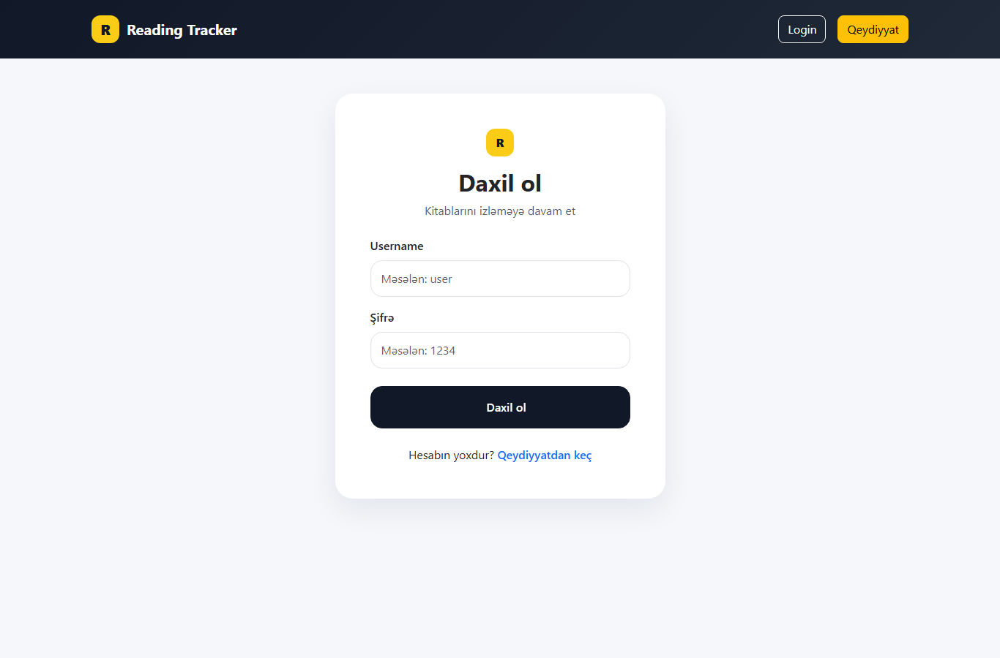

# ReadingTracker

Personal reading tracker web application built with ASP.NET Core MVC and JSON-based storage. The app includes registration, login, book tracking, reading statuses, and a clean responsive interface.

## Features

- User registration and login
- Cookie-based authentication
- Add books with title and author
- Track reading status
- JSON file-based data storage
- Responsive Bootstrap UI

## Screenshot



## Tech Stack

- ASP.NET Core MVC
- C#
- JSON data storage
- Bootstrap
- HTML, CSS

## Run Locally

```bash
dotnet restore ReadingTracker.slnx
dotnet build ReadingTracker.slnx
dotnet run --project ReadingTracker.csproj --no-launch-profile --urls http://127.0.0.1:5093
```

Open:

```text
http://127.0.0.1:5093/login
```
